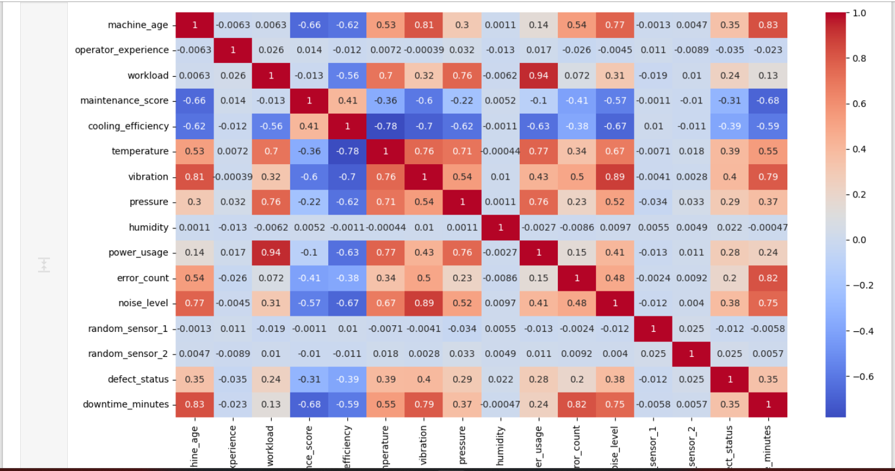
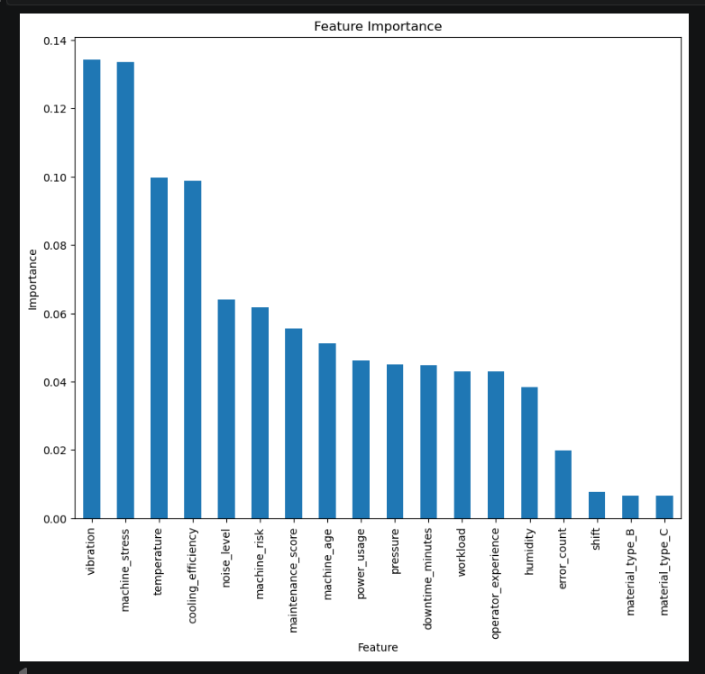
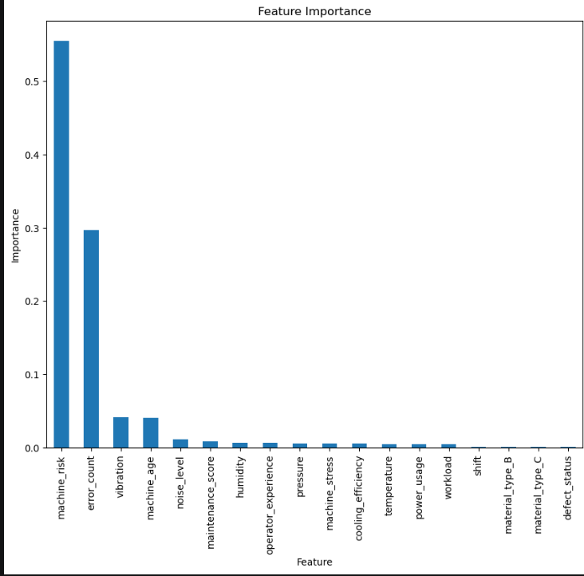
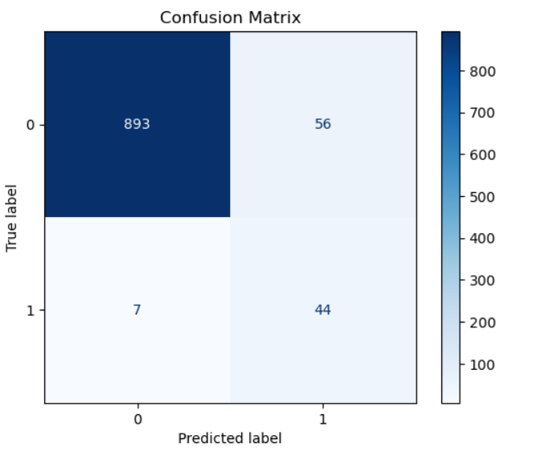
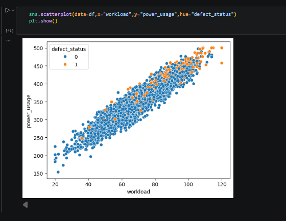

# 🏭 Machine Quality Prediction

## 📌 Project Overview

This project predicts the quality of manufactured products using Machine Learning techniques. It uses Random Forest Classification and Regression models to analyze manufacturing data and predict product quality and defect status.

The project demonstrates a complete machine learning workflow including data preprocessing, exploratory data analysis (EDA), feature engineering, model training, evaluation, and visualization.

---

## 📂 Project Structure

```
machine-quality-prediction
│
├── dataset/
│   └── smart_factory_synthetic_dataset_5000.csv
│
├── images/
│
├── notebook/
│   └── machine_quality_prediction.ipynb
│
├── .gitignore
└── README.md
```

---

## 🚀 Features

- Data Cleaning
- Exploratory Data Analysis (EDA)
- Correlation Analysis
- Random Forest Classification
- Random Forest Regression
- Model Evaluation
- Data Visualization

---

## 🛠️ Technologies Used

- Python
- Pandas
- NumPy
- Matplotlib
- Seaborn
- Scikit-learn
- Jupyter Notebook

---

## 📊 Dataset

The project uses a synthetic smart factory manufacturing dataset containing production parameters and product quality information.

Example features include:

- Temperature
- Pressure
- Humidity
- Machine Speed
- Vibration
- Defect Status
- Quality Score

---

## 📈 Machine Learning Models

### Classification Model

- Algorithm: Random Forest Classifier

| Metric | Value |
|---------|------:|
| Accuracy | **93.7%** |
| Precision (Weighted Avg) | **0.96** |
| Recall (Weighted Avg) | **0.94** |
| F1-Score (Weighted Avg) | **0.95** |

### Regression Model

- Algorithm: Random Forest Regressor

| Metric | Value |
|---------|------:|
| R² Score | **0.902** |
| MAE | **8.43** |
| MSE | **115.10** |
| RMSE | **10.73** |

## 📷 Visualizations

### Correlation Heatmap



---

### Classification Feature Importance



---

### Regression Feature Importance



---

### Confusion Matrix



---

### Workload vs Power Usage



---

### Material Type vs Defect Status


---

### Material Type and Humidity vs Defect Status


---

### Shift vs Defect Status


## 📌 Future Improvements

- Hyperparameter Tuning
- Cross Validation
- XGBoost Implementation
- Model Explainability using SHAP
- Streamlit Web Application

---

## 👨‍💻 Author

Kevin Johnson

GitHub:
https://github.com/kevinjoe1